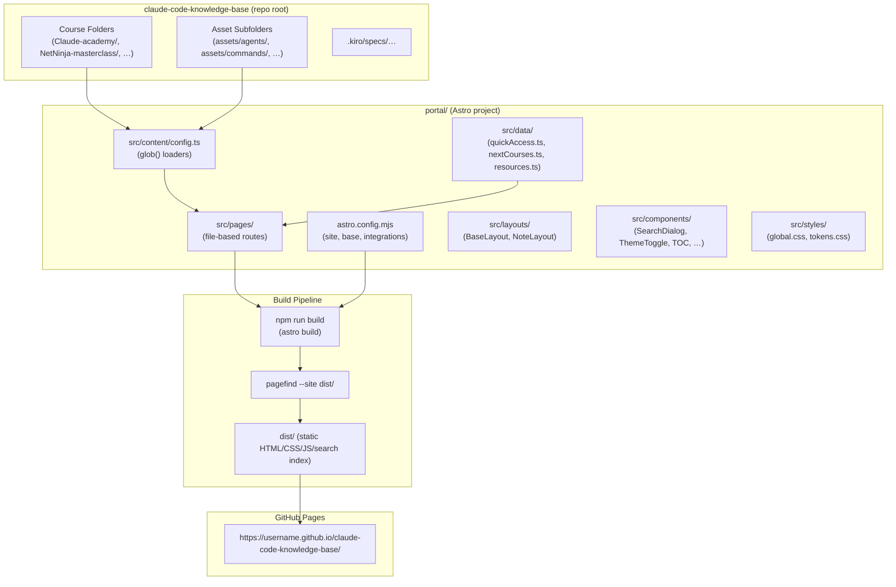

# Design Document

## Overview

The personal AI learning portal is a fully-static, GitHub-Pages-compatible site built with **Astro 5** that reads existing Markdown course notes from the `claude-code-knowledge-base` repository root at build time and renders them as a navigable, searchable, well-styled reference site. No content is modified or generated — the portal is a pure rendering layer over the existing `.md` files.

Key design decisions:

- **Astro 5 with Content Layer API** — the `glob()` loader can target directories outside `src/`, enabling the portal to sit in a subdirectory (`portal/`) while pointing directly at the sibling course folders in the repo root.
- **Pagefind** — runs as a post-build step, crawls the generated HTML, and deposits a WASM-based static search index alongside the site output. Zero runtime server cost.
- **`rehype-mermaid`** — a rehype plugin invoked during Astro's Markdown pipeline converts `mermaid` fenced code blocks to inline SVG at build time, eliminating client-side Mermaid.js.
- **Shiki** (built into Astro) — provides server-side syntax highlighting for all other fenced code blocks; no client-side JS required.
- **No framework JS** for components — Astro's zero-JS-by-default output model is used throughout; the only shipped JS is for the theme toggle, search dialog, copy-to-clipboard, TOC scroll-spy, and drawer navigation.

---

## Architecture



### Directory Layout

The Astro project lives in `portal/` at the repo root, keeping it separate from the course content:

```
claude-code-knowledge-base/
├── Claude-academy/
│   ├── anthropic_claude_101.md
│   └── anthropic_claude_code_in_action.md
├── NetNinja-masterclass/
│   ├── claude-code-masterclass-notes.md
│   └── assets/
│       ├── agents/
│       ├── commands/
│       └── skills/
├── portal/                      ← Astro project root
│   ├── astro.config.mjs
│   ├── package.json
│   ├── src/
│   │   ├── content/
│   │   │   └── config.ts        ← content collections with glob() loaders
│   │   ├── data/
│   │   │   ├── quickAccess.ts
│   │   │   ├── nextCourses.ts
│   │   │   └── resources.ts
│   │   ├── pages/
│   │   │   ├── index.astro
│   │   │   ├── courses/
│   │   │   │   ├── index.astro
│   │   │   │   └── [course]/
│   │   │   │       ├── index.astro
│   │   │   │       └── [note].astro
│   │   │   ├── quick-access.astro
│   │   │   ├── next-courses.astro
│   │   │   └── resources.astro
│   │   ├── layouts/
│   │   │   ├── BaseLayout.astro
│   │   │   └── NoteLayout.astro
│   │   ├── components/
│   │   │   ├── CourseCard.astro
│   │   │   ├── SearchDialog.astro
│   │   │   ├── ThemeToggle.astro
│   │   │   ├── TOC.astro
│   │   │   ├── Breadcrumb.astro
│   │   │   ├── CopyButton.astro
│   │   │   └── DrawerNav.astro
│   │   └── styles/
│   │       ├── tokens.css       ← CSS custom properties (colors, radii, fonts)
│   │       └── global.css
│   └── .github/
│       └── workflows/
│           └── deploy.yml
└── .kiro/
    └── specs/personal-ai-learning-portal/
```

---

## Components and Interfaces

### Content Discovery (Content Layer API)

`src/content/config.ts` defines two collections using Astro 5's `glob()` loader pointed at sibling directories relative to the portal project root:

```ts
import { defineCollection, z } from 'astro:content';
import { glob } from 'astro/loaders';

// Notes: top-level .md files in each course folder
export const notes = defineCollection({
  loader: glob({
    pattern: '*/*.md',
    base: '../',              // repo root, one level above portal/
    exclude: ['portal/**', '.kiro/**'],
  }),
  schema: z.object({
    // frontmatter is optional; all fields default to undefined
    title: z.string().optional(),
    provider: z.string().optional(),
    sourceUrl: z.string().url().optional(),
  }),
});

// Assets: .md files under assets/** subfolders
export const assets = defineCollection({
  loader: glob({
    pattern: '*/assets/**/*.md',
    base: '../',
    exclude: ['portal/**', '.kiro/**'],
  }),
  schema: z.object({
    title: z.string().optional(),
    description: z.string().optional(),
  }),
});

export const collections = { notes, assets };
```

**Course metadata** (provider name, source URL) is supplied via a per-course `_course.json` file placed in each course folder (e.g. `Claude-academy/_course.json`). This avoids modifying existing `.md` files and satisfies Requirement 6.1's need for a configured provider name.

### Name Derivation Utilities

`src/lib/naming.ts` exports pure functions for slugifying and display-formatting:

```ts
// Convert a folder/file name to a URL-safe slug
export function toSlug(name: string): string;

// Convert a folder name to display title (hyphens/underscores → spaces, title case)
export function folderToTitle(folderName: string): string;

// Extract first H1 from Markdown source; fall back to filename title
export function extractTitle(content: string, filename: string): string;

// Count only root-level .md files in a course (excluding assets/)
export function countNotes(entries: CollectionEntry<'notes'>[], course: string): number;
```

### Page Components

| Component | Description |
|-----------|-------------|
| `BaseLayout.astro` | Global shell: `<html>`, `<head>`, semantic `<header>/<main>/<footer>`, ThemeToggle, skip-to-content link |
| `NoteLayout.astro` | Three-column layout: left sidebar (note list), center (rendered note), right sidebar (TOC). Collapses per Requirement 14 |
| `CourseCard.astro` | Displays course name, provider, note count, optional source URL link |
| `SearchDialog.astro` | Native `<dialog>` element housing the Pagefind UI widget; opened via Ctrl+K / Cmd+K |
| `ThemeToggle.astro` | `<button>` that toggles `data-theme` attribute on `<html>` and persists to `localStorage` |
| `TOC.astro` | Renders H2/H3 headings as anchor links; IntersectionObserver scroll-spy highlights active heading |
| `Breadcrumb.astro` | Renders `Home › Courses › [Course] › [Note]` with proper `aria-label="breadcrumb"` |
| `CopyButton.astro` | Copy-to-clipboard button injected into each `<pre>` block via CSS/JS post-processing |
| `DrawerNav.astro` | Off-canvas drawer for left sidebar on mobile; controlled via `aria-expanded` toggle |

### Static Data Files

Curated content (Quick Access, Next Courses, Resources) is stored as typed TypeScript data in `src/data/`:

```ts
// src/data/quickAccess.ts
export const quickAccessLinks = [
  { label: 'Anthropic Skilljar', url: 'https://anthropic.skilljar.com' },
  { label: 'Claude Academy',     url: 'https://anthropic.skilljar.com/claude-101' },
  { label: 'Claude Partners Network', url: '...' },   // URL to be confirmed
] as const;

// src/data/nextCourses.ts
export const nextCourses = [
  'FastAPI for AI Engineers',
  'Net Ninja Git Crash Course',
  'Complete Agentic AI Course',
  'Claude Code (DeepLearning.AI)',
  'Claude Architect Exam Guide',
] as const;

// src/data/resources.ts
export interface Resource { name: string; description: string; url: string; category: string; }
export const resources: Resource[] = [
  {
    name: 'ccstatusline',
    description: 'A lightweight status line plugin for showing Claude Code context in your terminal prompt.',
    url: 'https://github.com/...',   // actual URL to be confirmed
    category: 'Developer Tools',
  },
];
```

Adding new resources requires only editing `resources.ts` — no structural code changes (Requirement 12.3).

### Search Integration (Pagefind)

Pagefind runs as a separate post-build step:

```json
// package.json scripts
{
  "build": "astro build && pagefind --site dist --output-path dist/_pagefind",
  "preview": "astro preview"
}
```

The `SearchDialog` component lazy-loads `/_pagefind/pagefind-ui.js` only when the dialog is opened, keeping the initial page weight minimal:

```ts
// SearchDialog.astro — client script
document.addEventListener('keydown', (e) => {
  if ((e.ctrlKey || e.metaKey) && e.key === 'k') {
    e.preventDefault();
    openDialog();   // dynamically imports pagefind-ui if not loaded
  }
  if (e.key === 'Escape') closeDialog();
});
```

### Markdown Pipeline

`astro.config.mjs` configures the Markdown pipeline:

```js
import { defineConfig } from 'astro/config';
import rehypeMermaid from 'rehype-mermaid';

export default defineConfig({
  site: 'https://username.github.io',
  base: '/claude-code-knowledge-base',
  markdown: {
    syntaxHighlight: 'shiki',
    shikiConfig: { theme: 'github-dark' },
    remarkPlugins: ['remark-gfm'],
    rehypePlugins: [
      [rehypeMermaid, { strategy: 'inline-svg' }],
    ],
  },
  integrations: [],
});
```

Shiki handles all fenced code blocks. The `rehype-mermaid` plugin intercepts `<code class="language-mermaid">` elements and replaces them with inline SVG at build time — no client-side Mermaid.js is loaded.

### Theme System

CSS custom properties are defined for both themes on `:root` and `[data-theme="light"]` / `[data-theme="dark"]` selectors. The ThemeToggle script applies the user's stored preference (or OS default) synchronously in a `<script>` tag placed in `<head>` to avoid FOUC:

```html
<!-- BaseLayout.astro <head> -->
<script>
  const stored = localStorage.getItem('theme');
  const prefersDark = window.matchMedia('(prefers-color-scheme: dark)').matches;
  document.documentElement.dataset.theme = stored ?? (prefersDark ? 'dark' : 'light');
</script>
```

### Responsive Layout Strategy

| Viewport | Layout |
|----------|--------|
| ≥1024px (desktop) | Three-column: left sidebar + content + TOC |
| 640–1023px (tablet) | Two-column: content + TOC; left sidebar accessible via toggle button |
| <640px (mobile) | Single-column; left sidebar in off-canvas drawer (DrawerNav) |

CSS Grid is used for the three-column layout. Media queries swap the grid template and hide/show panels without JavaScript layout calculation.

### Content Validation

A build-time Vite plugin (`portal/src/plugins/contentValidator.ts`) hooks into Astro's build via `astro:build:done` integration hook to:
1. Scan all emitted HTML for internal `<a href>` and `` references.
2. Check each resolved local path against the emitted file list.
3. Emit `console.warn` messages (non-fatal) for unresolved references, satisfying Requirement 18 without blocking the build.

---

## Data Models

### Content Collection Entry

Each `notes` collection entry produced by the `glob()` loader exposes:

```ts
interface NoteEntry {
  id: string;           // e.g. "Claude-academy/anthropic_claude_101"
  data: {
    title?: string;     // from frontmatter (optional)
    provider?: string;  // from _course.json merge (optional)
    sourceUrl?: string; // from _course.json merge (optional)
  };
  body: string;         // raw Markdown source
  render: () => Promise<{ Content: AstroComponent; headings: MarkdownHeading[] }>;
}
```

### Derived Course Model

Built at runtime in `getStaticPaths()` by grouping `notes` entries by their top-level folder segment:

```ts
interface CourseModel {
  slug: string;         // e.g. "claude-academy"
  folderName: string;   // e.g. "Claude-academy"
  displayName: string;  // e.g. "Claude Academy" (folderToTitle applied)
  provider: string;     // from _course.json
  sourceUrl?: string;   // from _course.json
  noteCount: number;    // count of root-level .md files only
  notes: NoteModel[];
}

interface NoteModel {
  slug: string;         // e.g. "anthropic-claude-101"
  filename: string;     // e.g. "anthropic_claude_101"
  displayTitle: string; // from H1 or filename title-case
  entryId: string;      // content collection entry id
}
```

### Asset Model

```ts
interface AssetModel {
  courseSlug: string;
  category: string;     // e.g. "agents", "commands", "skills"
  filename: string;
  displayTitle: string; // from frontmatter title or filename
  body: string;         // raw Markdown/YAML content
}
```

### Static Data Models

```ts
interface QuickAccessLink { label: string; url: string; }
interface ResourceEntry {
  name: string;
  description: string;
  url: string;
  category: string;
}
```

### _course.json Schema

Per-course metadata file placed at the root of each course folder:

```json
{
  "provider": "Anthropic",
  "sourceUrl": "https://anthropic.skilljar.com/claude-101"
}
```

This schema is validated at build time by Astro's content collection Zod schema when merged into note entries.

---

## Correctness Properties

*A property is a characteristic or behavior that should hold true across all valid executions of a system — essentially, a formal statement about what the system should do. Properties serve as the bridge between human-readable specifications and machine-verifiable correctness guarantees.*


### Property 1: Course name derivation is deterministic

*For any* folder name string (containing hyphens, underscores, mixed case, or combinations thereof), applying `folderToTitle` should produce a string where all hyphens and underscores are replaced by spaces and each word begins with an uppercase letter.

**Validates: Requirements 2.3**

---

### Property 2: Note title extraction prefers H1, falls back to filename

*For any* Markdown content string and filename pair, `extractTitle` should return the text content of the first H1 heading when one is present, and should return the title-cased filename (hyphens/underscores replaced by spaces) when no H1 heading is present.

**Validates: Requirements 2.4**

---

### Property 3: Note count excludes asset subdirectory files

*For any* set of content collection entries belonging to a course (including some entries from `assets/` subfolders), `countNotes` should return a count equal only to the number of entries whose path does not contain a subdirectory segment — i.e., root-level `.md` files only.

**Validates: Requirements 2.5**

---

### Property 4: Auto-discovered courses match the filesystem

*For any* build-time filesystem state where the repo root contains N top-level folders each with at least one `.md` file (excluding `portal/` and `.kiro/`), the set of courses returned by the content collection should have exactly N entries with slugs derived from those folder names.

**Validates: Requirements 2.1, 2.2**

---

### Property 5: Mermaid fences produce SVG, not raw code blocks

*For any* Markdown document containing one or more fenced code blocks labelled `mermaid`, the rendered HTML output should contain SVG elements in place of those fences and should contain no `<pre>` or `<code>` elements with the class `language-mermaid`.

**Validates: Requirements 1.4**

---

### Property 6: Syntax highlighting is applied to labelled code blocks

*For any* Markdown document containing a fenced code block with a language identifier (e.g. `typescript`, `python`, `bash`), the rendered HTML output should wrap the block's content in a highlighted structure (produced by Shiki) rather than emitting plain unstyled text.

**Validates: Requirements 1.3**

---

### Property 7: Course cards contain required fields and no invented metadata

*For any* discovered course, the rendered course card HTML should contain: (a) the course display name derived by `folderToTitle`, (b) the provider name from the course's `_course.json`, and (c) the note count; AND the card should not contain text matching duration patterns (e.g. "hours", "minutes"), difficulty levels (e.g. "beginner", "intermediate", "advanced"), or rating indicators (e.g. stars, scores, badges).

**Validates: Requirements 6.1, 6.2, 5.6**

---

### Property 8: Source URL link appears when configured

*For any* course whose `_course.json` defines a `sourceUrl`, the rendered course card should contain an anchor element (`<a>`) whose `href` attribute equals that `sourceUrl`. *For any* course without a `sourceUrl`, no such anchor pointing to an external source URL should be present on the card.

**Validates: Requirements 6.3, 20.1, 20.2, 20.3**

---

### Property 9: Breadcrumb navigation reflects the correct hierarchical path

*For any* rendered note reader page, the breadcrumb component should contain exactly four items in order: "Home" (linking to `/`), "Courses" (linking to `/courses`), the course display name (linking to `/courses/[course]`), and the note display title (current page, no link or aria-current="page").

**Validates: Requirements 7.2**

---

### Property 10: Previous/next navigation is consistent with filesystem ordering

*For any* note that is not the first in its course (by filesystem order), the rendered page should contain a "previous note" link pointing to the preceding note. *For any* note that is not the last in its course, the rendered page should contain a "next note" link pointing to the following note. *For any* note that is both the first and last (only note), neither link should be present.

**Validates: Requirements 7.3**

---

### Property 11: TOC entries match the note's H2 and H3 headings

*For any* note content, the number and text content of TOC anchor entries should equal exactly the H2 and H3 headings present in that note's Markdown source, in document order. *For any* note with no H2 or H3 headings, no TOC sidebar should be rendered.

**Validates: Requirements 7.5, 7.6**

---

### Property 12: Copy buttons are present on all fenced code blocks

*For any* rendered note or asset page that contains one or more fenced code blocks, each `<pre>` element in the rendered HTML should have an associated copy-to-clipboard button element as a sibling or child.

**Validates: Requirements 7.4, 8.4**

---

### Property 13: Theme selection persists across page loads

*For any* theme value in `{'light', 'dark'}`, after the user sets that theme via the theme toggle (which stores the value in `localStorage`), the theme initialization script on any subsequent page load should read that value from `localStorage` and apply `data-theme="[value]"` to the `<html>` element before first paint, overriding the OS preference.

**Validates: Requirements 13.3**

---

### Property 14: Content validator emits warnings for broken internal links

*For any* Markdown note containing an internal link (a Markdown link whose target is a local filesystem path) that does not resolve to an existing file in the build output, the content validator should emit at least one warning message that includes both the source file path and the unresolved target path.

**Validates: Requirements 18.1, 18.2**

---

## Error Handling

### Build-Time Errors

| Scenario | Behaviour |
|----------|-----------|
| Course folder has no `.md` files | Folder is silently skipped; no course entry is created. |
| `_course.json` missing for a course | Build continues; `provider` defaults to the folder display name, `sourceUrl` is omitted. |
| `_course.json` has invalid JSON | Astro content validation emits a build error; build fails with a descriptive message. |
| Markdown file cannot be parsed | Content validator emits a build warning; file is included with raw content fallback (Requirement 18.3). |
| Broken internal link in a note | Content validator emits a non-fatal warning; build continues (Requirement 18.1). |
| Mermaid diagram syntax error | `rehype-mermaid` emits a warning and replaces the diagram with an error message element; build does not fail. |
| `pagefind` binary not found | The `npm run build` script exits with a non-zero status, failing the CI job (Requirement 17.2). |

### Runtime Errors (Client-Side)

| Scenario | Behaviour |
|----------|-----------|
| `localStorage` unavailable (private browsing) | Theme initialization catches the `SecurityError` and falls back to OS `prefers-color-scheme`. |
| Pagefind WASM fails to load | Search dialog shows a user-friendly "Search unavailable" message; rest of the page is unaffected. |
| Clipboard API unavailable | Copy button catches the error and falls back to a `window.prompt` with pre-selected text. |
| JavaScript disabled | All primary content is pre-rendered HTML; theme defaults to OS preference via CSS `prefers-color-scheme`; search dialog is hidden; copy buttons are absent (progressive enhancement). |

---

## Testing Strategy

### Assessment: Is Property-Based Testing Appropriate?

This feature is primarily a **static site build pipeline** — content is discovered from the filesystem, transformed through a Markdown rendering chain, and emitted as static HTML. The core logic layers suitable for PBT are:

1. **Name derivation utilities** (`folderToTitle`, `extractTitle`, `countNotes`) — pure functions with well-defined input/output behavior and large input spaces.
2. **Content discovery grouping** — the logic that partitions content collection entries into courses and notes.
3. **Navigation link generation** — the prev/next ordering logic.
4. **Breadcrumb construction** — the path assembly logic.
5. **Content validator** — the link-checking logic.
6. **TOC generation** — heading extraction logic.

Infrastructure (GitHub Actions workflow), UI rendering, and Pagefind integration are **not** suitable for PBT and will use example-based and smoke tests instead.

### Property-Based Testing Library

**[fast-check](https://fast-check.dev/)** (TypeScript) is the chosen PBT library. It integrates with Vitest, supports arbitrary generators for strings, arrays, and objects, and has excellent TypeScript type inference.

Each property test is configured to run **minimum 100 iterations** (`numRuns: 100`).

Tag format: `// Feature: personal-ai-learning-portal, Property N: <property_text>`

### Unit Tests (Example-Based)

Focused on specific concrete behavior:

- **Homepage rendering**: verify the built `index.html` contains the hero section, exactly N course cards (one per course), Quick Access links, and Next Courses list.
- **Route existence**: verify every expected route (`/courses`, `/courses/[course]`, `/courses/[course]/[note]`, `/quick-access`, `/next-courses`, `/resources`) has a corresponding `.html` file in `dist/`.
- **Static data integrity**: verify the three Quick Access links match the specified URLs, the five Next Course titles appear in order, and `ccstatusline` is present on the resources page.
- **Semantic HTML**: verify `<nav>`, `<main>`, `<article>`, `<aside>`, `<header>`, `<footer>` are present in the correct page regions.
- **Theme script**: verify the `<head>` contains the synchronous theme-initialization script.
- **Accessibility attributes**: verify ARIA labels on the search dialog, theme toggle, drawer navigation, and copy buttons.
- **Responsive CSS**: verify the stylesheet contains the `min-width: 1024px`, `min-width: 640px`, and `max-width: 639px` media query breakpoints.
- **System fonts**: verify CSS contains the specified system font stacks and no `@import` or `<link>` for external fonts.
- **`prefers-reduced-motion`**: verify CSS contains `@media (prefers-reduced-motion: reduce)` rules that remove transitions.
- **Mermaid integration**: verify at least one rendered note page contains an SVG element derived from a mermaid block.
- **Pagefind output**: verify `dist/_pagefind/` directory and index files exist after `npm run build`.
- **CI workflow**: verify `.github/workflows/deploy.yml` contains push trigger on default branch, `npm install`, `npm run build`, and `actions/deploy-pages` step.

### Smoke Tests

- Build completes without errors (`npm run build` exits 0).
- `dist/` directory is non-empty after build.
- `dist/index.html` exists.
- No server-side runtime is referenced in `dist/` output.

### Integration Tests

- End-to-end build smoke: all course content from the real repo renders without errors (run in CI).
- CI/CD workflow validation: verify the GitHub Actions YAML is syntactically valid and references the correct actions.

### Test Configuration

```ts
// vitest.config.ts (inside portal/)
import { defineConfig } from 'vitest/config';
export default defineConfig({
  test: {
    globals: true,
    include: ['src/**/*.{test,spec}.ts'],
  },
});
```

Property tests are co-located with the modules they test (e.g. `src/lib/naming.test.ts`). Build output tests live in `tests/build/` and run after `npm run build` in CI.
