# Claude Code MasterClass — Notes

Raw capture for now — terse bullets/notes as content comes in, diagrams only where they actually clarify a relation. We'll decide on final formatting (maybe a browsable HTML version) once there's enough real content to design around.

---

## Chapter 1

- `/ide` — connects a terminal-started Claude Code session to VS Code

- Onboard yourself + Claude on the codebase, every new project
  Prompt used: "Analyze the codebase and provide a summary of this project, outlining any frameworks, architecture, or main features."

- Permissions: Claude Code reads files freely, but asks before running bash commands or editing files → choices are Yes / Yes-don't-ask-again-for-this-command-type / No

- Session lifecycle:
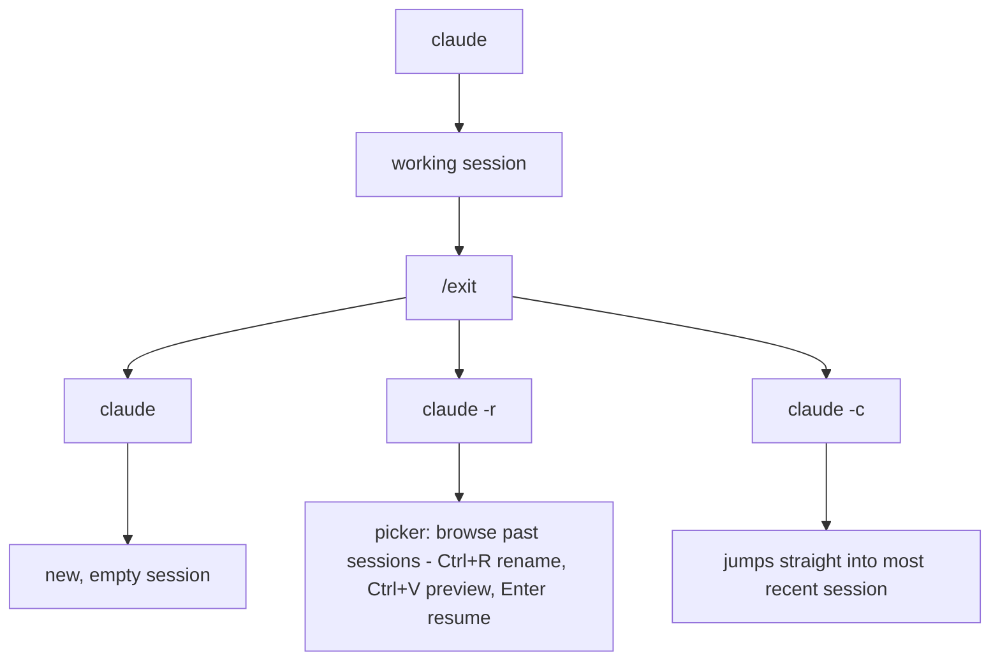
  - session history persists automatically while open, giving Claude context for later questions/changes in that session
  - no CLI delete yet — manual cleanup: `~/.claude/projects/<project-name>/` holds each session as several JSON files (state/context/planning/agent-behavior split apart, not one file) — delete them for a hard reset
  - that folder is hidden — show hidden files (Mac: ⌘+Shift+.; Windows: Ctrl+Shift+.)

---

## Chapter 2 — Commands, Context, Tools & Hooks

### Slash commands
- Type `/` alone → full list of built-in commands, arrow keys to browse
- A command = invoke a behaviour, a prompt, or change a setting
- Ones worth remembering: `/doctor` (verify install is healthy), `/usage` (session + weekly + extra usage), `/config` (global settings: tips, thinking mode, verbose output), `/theme`, `/model`, `/login` `/logout`, `/upgrade`, `/exit`
- Esc or Enter exits these interactive screens

### `/init` → CLAUDE.md
- **Why:** eliminate guess-work. Instead of Claude re-scanning the whole codebase every session, it reads one file that already states stack, conventions, architecture, commands, test setup
- **How:** `/init` analyses the codebase and writes `CLAUDE.md` at the project root (markdown). Auto-loaded as context into *every* session
- **When:** run it on an existing project with real structure to analyse. On a blank project it produces noise — instead hand-write your non-negotiables first, run `/init` later once there's something to read
- Not write-once: update it as the stack/folder structure changes, or it drifts into lying to the model
- It's just a file — you can hand-append your own rules (e.g. "no semicolons", "use `git switch -c`, not `git checkout`", "minimal dependencies"). Without those, models default back to their own habits
- **Scope:**

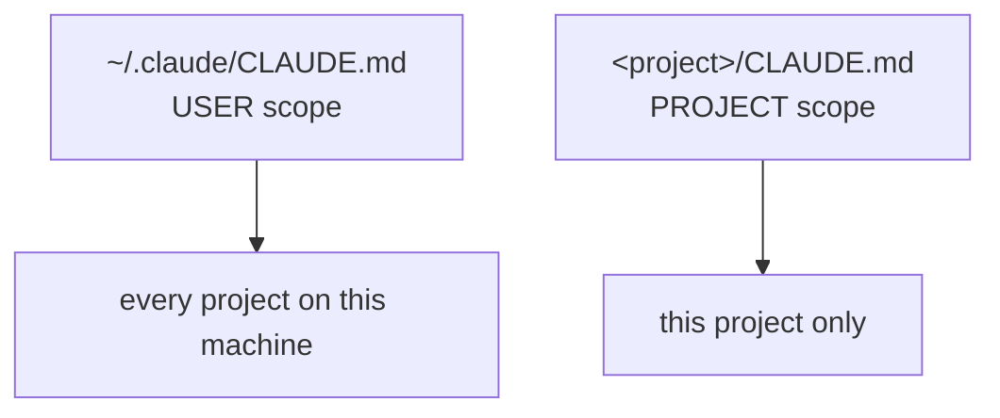
  User-scope file is created manually (no `/init` for it) — for personal style/tooling preferences that aren't project-specific

### Adding context to a single prompt
- `@` + path → adds a file. Start typing the name and it fuzzy-searches; Enter fills the full path
- `@` a **folder** → adds everything in it (cheaper than listing 3 files individually when they share a parent)
- **Implicit context:** the file open in the editor with your cursor in it is auto-attached. Highlight a region and only that selection is attached (terminal shows "N lines selected") — the sharpest way to point at "this exact thing"
- `@` also works *inside* CLAUDE.md — imports another file's contents as context (e.g. an example test suite to copy practices from, or a file elsewhere on disk with git-message rules)
- **Images:** drag the file into the terminal, paste from clipboard directly into the prompt, or `@` the image path. Main use: design references, screenshots of a bug/error, UI to replicate

### Context window
- Everything accumulates in one budget: system prompt + system tools + MCP tools + memory files (CLAUDE.md) + manually added files/images + full conversation history
- Claude Code's window ≈ 200k tokens (~500 pages). Large, but it fills

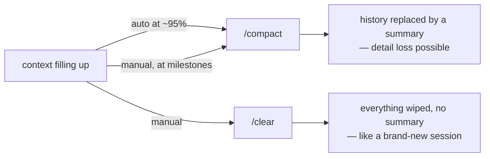
- `/context` → visual breakdown of what's eating the window + free space left
- `/compact` accepts optional custom summarisation instructions — tell it what must survive the squash
- `/rewind` (or **Esc Esc**) → checkpoint picker. Three restore options: conversation + code / conversation only / code only
  - Typical use: you drifted off-topic — rewind the *conversation* to before the detour to clean the window, but keep the *code* if the detour produced something useful
- Hygiene that actually helps: one session per feature/area (don't pollute an auth session with UI-component chatter); `/compact` at milestones; rewind when off-track

### Tools
- A model alone can only reason and generate text. Tools are the bridge that lets it actually read/write/run things
- Loop: your prompt → model reasons → model picks tools → Claude Code executes them (asking permission where required) → result back to model

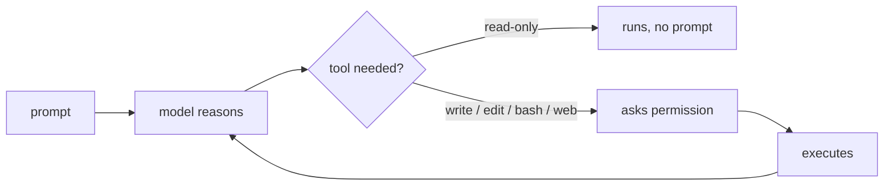
- Built-ins include: Read, Write, Edit, Bash, Glob (file-pattern matching), Grep (search text/regex inside files), WebFetch, WebSearch, AskUserQuestion (model asking *you* to clarify)
- Full current list lives in the Claude Code docs → **docs.claude.com** (tools reference). You never call these manually; good to know they exist so you can reason about permissions and cost

### Permissions
- Default: read-only tools run freely; anything that writes, edits or executes asks first
- **Session-level shortcut:** choose "allow all edits this session" → banner shows "accept edits on". Resets when the session ends
  - `Shift+Tab` once → plan mode; twice → back to default (manual permission). Toggle accept-edits with the same key
- **Persistent permissions** (survive sessions, stored in settings files) — three ways to add: type the tool name straight into the settings JSON, choose "allow this and future" in the permission dialog, or use `/permissions`
- `/permissions` has three tabs: **Allow** / **Ask** / **Deny** — each writes to the matching property in the settings file
- **Specifiers** make permissions granular: `Bash(git init)`, `Bash(git switch:*)` (`:*` = wildcard for anything after), `WebFetch(domain:...)`. Bare `Bash` = allow *any* command — rarely what you want

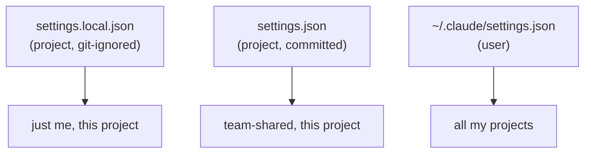

### Custom commands
- Live in `.claude/commands/<name>.md` — filename = command name (`commit-message.md` → `/commit-message`)
- A custom command is just a detailed, reusable prompt. Use it for any workflow you'd otherwise retype: commit messages, component scaffolds, feature specs, code reviews
- **Front matter** (between `---` fences):
  - `description:` — shown next to the command in the `/` list
  - `allowed-tools:` — comma-separated, with specifiers. Grants permissions **only within this command**, unlike settings-file permissions which apply project-wide. This is the key advantage
  - `argument-hint:` — `[brief description]`, shown in the input as a reminder when you type the command
- Body = plain markdown: headings, lists, code blocks. Backticks matter — wrap placeholder tokens like `<type>` in a code block or markdown eats them as HTML
- ⚠️ **New or edited files in `.claude/commands/` don't load until you restart the session** (`/exit` then `claude -r`, or start fresh). This bites often. Note: **skills** (`.claude/skills/`) do *not* have this problem — Claude Code watches that directory and picks up changes mid-session. One more reason to write new things as skills (see Ch. 5)

### Bash mode
- `!` in the chat input → run a bash command directly in the session (pink indicator); auto-returns to chat mode after
- **Why it matters:** the command's output lands in the session context, so the model can see it. Failing tests, git status, build errors — run them in bash mode and Claude already knows about them
- Use it for small commands you *want* in context; use a separate terminal for heavy work you don't
- **Inside a custom command:** `` !`git status` `` runs at command-invocation time and injects the output into the prompt before it reaches the model

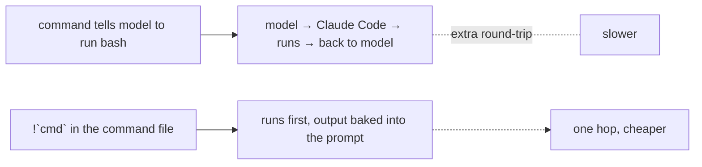

### Command arguments
- `$ARGUMENTS` (uppercase) in the command body is replaced by whatever text follows the command name
- **When to reach for it:** any command whose output should vary per invocation — `/component a button with a left icon`, `/review <file or PR>`, `/spec <feature name>`, `/fix <error text>`. If the command would otherwise be identical every run, it doesn't need arguments
- Pair with `argument-hint` in front matter so future-you is reminded what to pass
- **Multiple / optional arguments:** there's no real parsing — it's all one blob of text, so you parse it *in the prompt*. Conventions that work:
  - Hint: comma-separate square-bracketed items, wrap the whole value in quotes (the quotes just kill markdown syntax highlighting of the brackets) — `argument-hint: "[short description], [optional: 'key:<value>']"`
  - Body: tell the model how to extract each one — "if the arguments contain the substring `key:`, the text after it is the X; trim whitespace" — and give a worked example of input → extracted values. Without the example it guesses

### Hooks
- Hook = run a shell command (or fire a prompt) automatically on a Claude Code **lifecycle event**. Deterministic automation, not model discretion — it always runs
- Created with `/hooks`: pick event → optional matcher → command → scope. Written into the same settings files as permissions
- **Events** (full list in docs): `PreToolUse`, `PostToolUse`, `PermissionRequest`, `SessionStart`, `SessionEnd`, `UserPromptSubmit`, `Stop`, `Notification` …
- **Matcher** narrows which tools trigger it: `Write|Edit` (pipe = or). Blank matcher = fires on *every* tool use
- Settings shape: `hooks` → event name → array of `{ matcher, hooks: [{ type, command }] }`
  - `type: "command"` → run a shell command; `type: "prompt"` → auto-send a prompt to the model
- Hook output is hidden by default → **Ctrl+O** toggles verbose output (also shows model thinking)
- Good uses: auto-format after edits, logging sessions, blocking reads of sensitive files, running tests after changes

### jq + Prettier in a hook
- Claude Code **pipes JSON into the hook command on stdin** — event name, tool name, and `tool_input` (including `file_path` of the edited file). That JSON is the whole reason jq is involved
- **jq** = command-line JSON processor. Install: Mac `brew install jq`; Windows `winget` / `scoop` / `chocolatey`
- Debugging trick: dump the payload first so you can see its shape — `jq . > tool-use.json` — then write the real filter against it
- `jq -r '.tool_input.file_path'` → `-r` = raw output (no surrounding quotes), so the path is usable as a shell argument
- Then: pipe into a grouped command block, read into a variable, regex-test the extension, and only then run Prettier — so you don't run a TS formatter on a PNG

---

## Chapter 3 — Plan Mode & Specs

### The spec-driven workflow
- Three steps, each producing an artifact the next step consumes:

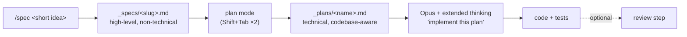
- **Why bother:** each artifact narrows guesswork before any code is written, and both artifacts are editable by you before they're used. You stay in the loop instead of accepting a black-box result
- Inspired by GitHub's **SpecKit**, but deliberately lighter — SpecKit's full ceremony detaches you from the process; this version hands agency back
- **Git is part of the workflow**: the spec command switches to a fresh feature branch, so a bad run is a deleted branch, not a polluted main. Treat this as non-negotiable when AI touches your code
- Commit the spec + plan *before* implementing — gives you a clean rewind point if implementation goes sideways

### Step 1 — the `/spec` command
- What it automates: derive a feature title + slug + branch name from your input → switch to that branch → write a high-level spec file from a template
- Front matter: `description`, `argument-hint: [short feature description]`, `allowed-tools: Read, Write, Glob, Bash` (Bash needed for the branch switch)
- Command body logic, in order:
  1. Check the current branch for uncommitted/unstaged changes → **abort** and tell the user to stash or commit first
  2. Parse `$ARGUMENTS` into: feature title, feature slug (lowercase, kebab-case, alphanumeric only, spaces → dashes), and a safe branch name in a fixed format (e.g. `claude/feature/<slug>`)
  3. Switch to the new branch
  4. Write the spec markdown into the specs folder, named by the slug, **following a template file added as context with `@`**
  5. Explicitly forbid technical implementation details / code examples — that's the planning step's job
  6. Reply with a short summary: branch name, spec file location, feature title
- Two supporting pieces have to exist: a specs folder (prefix with `_` purely so it sorts to the top of the tree) and `template.md` inside it

### The spec template
Sections Claude fills in:
- Feature name · branch name · (design-tool component reference, if you integrate one later)
- Summary
- Functional requirements
- Design reference (only if referenced)
- Possible edge cases
- Acceptance criteria
- **Open questions** — Claude's own clarifying questions, which you answer and fold back into the file. This is the highest-value section
- Testing guidelines — instruct it to create meaningful tests without going overboard; leave the actual cases to Claude

### Step 2 — plan mode
- **Read-only mode.** It cannot edit anything, so it's safe to let it roam the codebase
- Enter it with **Shift+Tab**, cycling through modes:

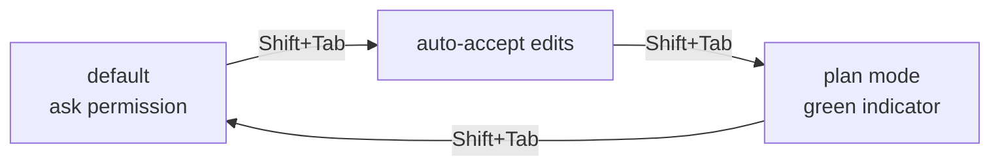
- **How it works internally:** spins up a **sub-agent** specialised in research/codebase exploration; the sub-agent reports back to the main agent, which writes the plan markdown
- Feed it the spec rather than a bare prompt — open the spec file so it's auto-attached as context, then: "plan the feature described in this spec." A bare prompt gets a decent plan; the spec gets a much more specific one
- **What the plan contains:** files to create/modify, new components, test files, ordered implementation steps with code examples, styling/architecture approach, design decisions *with reasoning*, technical considerations (types, accessibility), verification steps
- The point of the research step: the plan reflects **your existing codebase** — conventions already in use, classes already defined, CLAUDE.md rules (it picks up things like "no semicolons") — instead of generic boilerplate
- **At the end it offers to implement immediately.** Decline. Pick the "just save the plan" option and review/edit it first
- ⚠️ By default the plan is saved into the `.claude` folder in your **home** directory, not the project. Tell it to save to a project folder (e.g. `_plans/`) — it'll create the folder if missing
- The saved plan doubles as a progress tracker the model refers back to mid-implementation, which keeps long runs on rails

### Step 3 — implementation
- **Switch models here.** Sonnet is fine for small edits, specs, and planning (plan mode defaults to it). Opus follows a detailed instruction set closely and rarely deviates — worth switching to for complex/multi-step features via `/model`. For trivial features, staying on Sonnet is reasonable
- **Extended thinking:** model spends more time reasoning — explores alternatives, self-corrects, and spots holes in the plan and works around them. Costs tokens; noticeably faster burn on Opus
  - On by default; toggle in `/config` → *thinking mode* (saves to global user settings, all projects)
  - Quick toggle: **Option+T** (Mac) / **Alt+T** (Windows)
  - Per-prompt trigger without changing the setting: put **`ultrathink`** in the message
- Run it: open the plan file so it's auto-context → "can you implement this plan?" → turn auto-edit on to avoid babysitting permissions
- It iterates on its own errors (lint failures, failing tests) rather than stopping
- **Then actually read the output.** Budget real time reviewing the generated files — the failure mode of this workflow is a project drifting somewhere you no longer understand
- Close the loop: stage → `/commit-message` → merge the feature branch (bash mode works fine: `!git switch main`, `!git merge <branch>`)

---

## Chapter 4 — MCP Servers

### What MCP is and why it exists
- Everything so far (`@` files, implicit context, CLAUDE.md) gives Claude context about **your project**. None of it gives it access to anything *outside* — Figma, Firebase, a third-party API, your issue tracker
- **MCP = Model Context Protocol**, an Anthropic protocol for letting AI models interact with external systems in a controlled way. An MCP server is just a program implementing it, exposing **tools** (actions) and **resources** (readable data, e.g. docs) for one specific service
- The control boundary is the whole point:

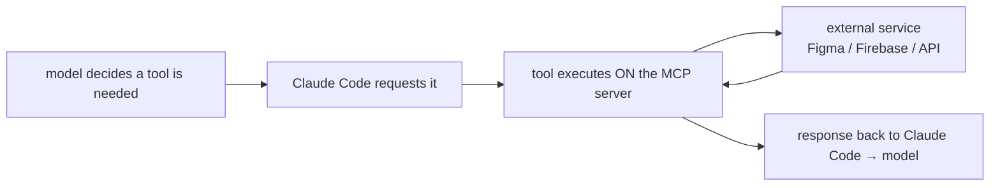
  Claude Code never talks to the external service directly and can only trigger tools the server chose to expose. The server does the heavy lifting; the model's job is deciding *when* to call a tool and how to combine it with others

### Adding a server — `claude mcp add`
- Run it in a **normal terminal, not inside a Claude Code session**
- Anatomy of the install command:
```bash
claude mcp add --transport http <name> <url> --header "Authorization: Bearer <key>" --scope local
```
  - `--transport` → `http` for remote servers, `stdio` (standard in/out) for local ones
  - `<name>` → how you'll refer to it
  - then the **URL** (remote) or the **command that launches it**, usually `npx …` (local)
  - `--header` → pass API keys
  - `--scope` → see below; omitted defaults to `local`
- **Remote vs local:** remote means only the *config* lives on your machine — the server runs elsewhere and is maintained/updated by its owner. Local means the server itself is installed and runs on your computer. Prefer remote when it's offered; one less thing to keep updated

### MCP scopes (⚠️ named like settings scopes, behaves differently)
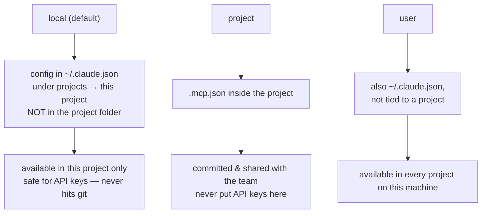
- The trap: MCP **local** scope ≠ settings **local** scope. With settings, "local" meant a `settings.local.json` file *inside* the project. With MCP, "local" means config stored in your home directory but *linked* to this project. There's no consistency here — just remember it
- `~/.claude.json` is a file in your home directory, **not** inside the `.claude/` folder sitting next to it. Structure: `projects → <project path> → mcpServers → <server name> → { type, url, headers }`

### Managing servers — `/mcp`
- Lists every server this project can reach, with connection status (green tick = connected). Run it after installing to confirm
- Enter on a server to get: **disable** (park it without uninstalling), **reconnect** (when a connection drops), **authenticate** via OAuth if supported, and **view exposed tools**
- Viewing tools is genuinely useful — it tells you what the model is actually able to request, which explains what it can and can't do with that service
- MCP tools also consume context window space (they show as their own line in `/context`) — a reason not to leave unused servers enabled

### MCP permissions
- Every MCP tool asks for permission the first time, out of the box
- Pick the "allow for this project" option, or add the tool via `/permissions` — either way it lands in `settings.local.json`
- Multi-step servers mean multiple prompts: a docs server that first resolves an ID and then queries it will ask twice before it's fully allowed

### Context7 — worth setting up once, for every project
- **What:** a large, continuously updated collection of documentation for frameworks and libraries (React, Next, Vue, Laravel, Flask, the Gemini API, Claude Code itself…). The website is searchable and shows each library's GitHub repo and when its docs were last updated; you can also chat with the docs there directly
- **Why it matters:** the model's training data goes stale, so it reaches for legacy or invented APIs. Context7 makes it check current docs before writing code. This is the most portable MCP server — nothing about it is project-specific
- **Install:**
  1. From the Context7 site → install link → its GitHub repo → find the Claude Code section. It lists both a remote and a local command; take the remote one
  2. **Get an API key first** — free account → dashboard → API keys → create → name it (e.g. "claude-code") → **copy it immediately, it's never shown again**
  3. Paste the key into the placeholder at the end of the command, run it in a plain terminal
  4. Verify with `/mcp` in a session
- **Tools it exposes:** `resolve-library-id` (name → library ID) and `query-docs` (fetch docs for that ID). Two-step, so two permission prompts the first time
- **Two ways to use it:**
  1. **Explicitly per prompt** — "check the Tailwind docs using Context7 to make sure these theme variables are set up correctly." Good for verifying code that already exists
  2. **Standing instruction in CLAUDE.md** — better, because you stop having to remember it:
     > When implementing library or framework specific features, always check the appropriate library or framework documentation using the Context7 MCP server before writing any code.
- Caveat: it won't always obey for trivial edits that don't need a doc check — that's fine. It does reliably fire for code using library-specific features or conventions
- Since it's project-agnostic, install it at **user scope** and put the instruction in your **user-level CLAUDE.md** if you want it everywhere by default

### Figma MCP
- Gives Claude Code access to design information and snapshots from a Figma file — dimensions, layout, typography, colors, borders, icons — so a component can be built against the actual design rather than a description of it

### ⭐ Extending your workflow with an MCP server (the transferable pattern)
The most reusable idea in the chapter. An MCP server doesn't have to be invoked ad-hoc — you **bake it into a custom command** so the whole workflow permanently gains that capability. Worked through with Figma + `/spec`, but the shape applies to any server:

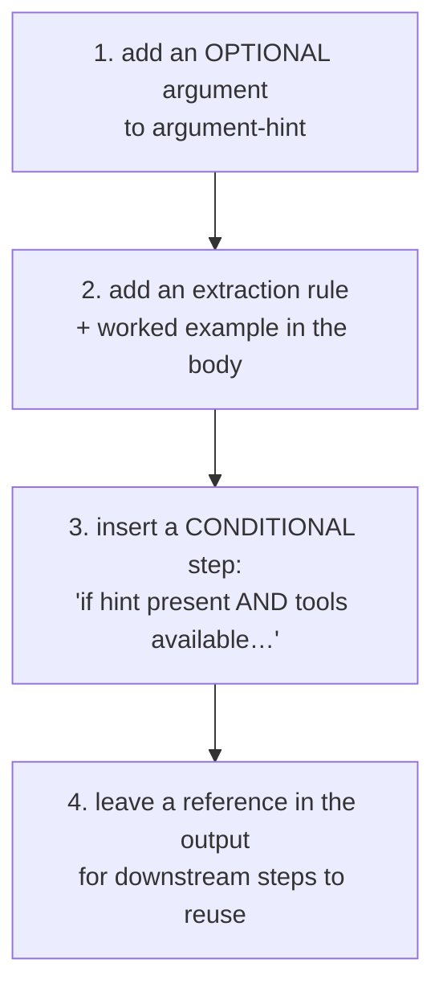

1. **Optional argument** — extend `argument-hint` to `"[short feature description], [optional: 'figma:<component link>']"`. Optional means the command still works exactly as before when you don't pass it
2. **Tell it how to parse** — in the argument-extraction section, add: if the arguments contain the substring `figma:`, the text after it is the component link; trim whitespace. Include an example input and the expected extraction
3. **Mention it in the high-level summary** at the top of the command too, so the model knows the capability exists before it reaches the detailed steps
4. **Insert a guarded step** — numbering it `2.5` slots it between existing steps without renumbering the rest (small trick, keeps command files maintainable). The guard is double: *if the hint is present* **and** *if the tools are available* → graceful degradation when the server is off or missing
5. **The step's job:** use the server's tools to locate the component/layer, extract the useful properties, summarise them as bullets in the output document
6. **Leave the link in the output** so the *next* stage of the workflow (the plan step) can look it up again — artifacts in a chain should carry forward the references they were built from

General lesson: custom commands are where capabilities compose. New MCP server → decide which step of your workflow it enriches → optional argument + extraction rule + guarded step.

---

## Chapter 5 — Skills & Plugins

### What a skill is
- A skill packages a **reusable capability** into markdown that teaches Claude Code how to do a specialised task *the way you want it done* — not the way it would default to. Data-model structure, mock-data generation, query patterns, branch-name formats, doc style
- Claude Code can already do all of those things. The skill fixes **how**
- So a skill is, in essence, another way of adding context — but loaded conditionally

### Progressive disclosure — the real reason skills beat CLAUDE.md
CLAUDE.md loads **in full, every session**. Pile detailed procedures into it and you pay that context cost on every prompt, whether or not it's relevant. Skills only load their name + description up front; the body arrives when it's actually needed.

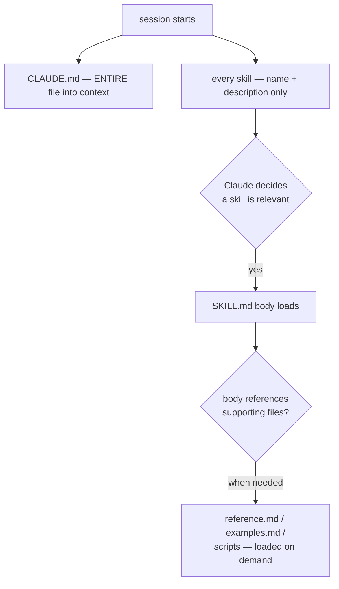
- Mental model: an **encyclopedia on standby** — opened only at the page it needs
- Division of labour: **CLAUDE.md = broad, always-true facts** ("use TypeScript strict mode", "no semicolons"). **Skills = detailed procedures for specific repeatable tasks**
- Secondary benefit: organisation. Each capability gets its own folder instead of one ever-growing CLAUDE.md
- ⚠️ **Nuance the course doesn't cover:** once a skill is invoked, its rendered content **stays in context for the rest of the conversation** — it isn't unloaded after the task. So keep the body concise; every line is a recurring cost. Under auto-compaction, skills are re-attached within a token budget (most recent first), so older ones can drop out entirely

### Anatomy and where skills live
- A skill is a **folder**, not a file — so it can bundle supporting material:
```text
.claude/skills/
└── firestore-schemas/
    ├── SKILL.md          ← required
    ├── reference.md      ← loaded only when SKILL.md points at it
    ├── examples.md
    └── scripts/
        └── helper.py     ← executed, not loaded into context
```
- Keep `SKILL.md` under ~500 lines; push detail into sibling files and link them from the body with a line saying what each contains
- **Locations**, in precedence order when names collide (enterprise → personal → project):

| Where | Path | Loads in |
|---|---|---|
| Personal | `~/.claude/skills/<name>/SKILL.md` | all your projects on this machine |
| Project | `.claude/skills/<name>/SKILL.md` | this repo — commit it to share with the team |
| Plugin | `<plugin>/skills/<name>/SKILL.md` | wherever the plugin is enabled, as `/plugin-name:skill-name` |
| Enterprise | managed settings directory | everyone in the org |

### Frontmatter — ⚠️ course is out of date here
The course writes `title:` and `description:`. **`title` is not a field.** Current reality:

- **`description`** — the only one that really matters. It is the *trigger*: always in context, and what Claude matches your request against to decide whether to load the skill. Write it as "what this does + **when to use it**", listing concrete situations. A vague description means the skill never fires
- **`name`** — optional, and for a personal/project skill it only sets the *display label*. **The command you type comes from the directory name.** (In a *plugin* skill, `name` does set the last segment of the command)
- **`when_to_use`** — extra trigger phrases, appended to the description
- **`allowed-tools`** — pre-approve tools for the turn that invokes the skill; the grant clears on your next message
- **`disable-model-invocation: true`** — only *you* can invoke it
- **`user-invocable: false`** — only *Claude* can invoke it
- **`argument-hint`**, **`arguments`** — same idea as custom commands; `$ARGUMENTS`, `$0`/`$1`, and named placeholders all work
- **`paths`** — globs that limit auto-activation to matching files
- **`context: fork`** + **`agent`** — run the skill in a subagent instead of inline
- **`model`**, **`effort`** — override model/reasoning level while the skill is active
- Dynamic context injection (`` !`git diff HEAD` ``) works in skill bodies exactly as in commands
- ⚠️ If you export a skill to claude.ai or the Skills API, only six fields are legal (`name`, `description`, `license`, `compatibility`, `metadata`, `allowed-tools`) — anything else is a hard error

### Invoking a skill
- **Autonomously** — the intended path. You describe a task; Claude matches it against skill descriptions and loads the relevant one without being told. It also fires *inside* a larger task (ask for a form wired to the database, and it reaches for your schema skill on the way)
- **Explicitly** — `/skill-name`, same as a command. Guarantees it runs
- Check what's loaded: ask "what skills are available?", or use `/skills`
- **If it's not triggering:** the description is almost always the problem — add the keywords you'd naturally use. Malformed YAML is the other cause (the body still loads, but with empty metadata, so auto-matching silently dies — `--debug` shows the parse error)
- **If it triggers too often:** tighten the description, or set `disable-model-invocation: true`

### ⭐ Which entity do I reach for?
The headline of this chapter. All of these are "ways to shape Claude Code's behaviour," and they're easy to confuse.

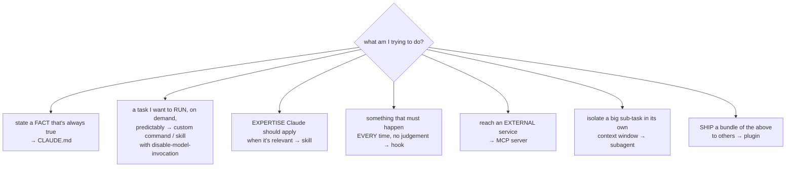

| Entity | Who triggers it | Deterministic? | Context cost | Use it for |
|---|---|---|---|---|
| **CLAUDE.md** | nobody — always loaded | n/a | full, every session | broad standing facts and rules |
| **Custom command** | **you**, by typing `/name` | yes — predictable behaviour | body only when invoked | repeatable tasks you want to fire deliberately |
| **Skill** | **Claude**, when it judges it relevant (or you, via `/name`) | no — model's judgement | description always; body on use | expertise/procedure: *how* you want a kind of task done |
| **Hook** | the lifecycle event | **yes — always runs** | none | formatting, logging, guards — anything that must not be optional |
| **MCP server** | model requests, server executes | no | tool definitions always | access to external services/data |
| **Subagent** | main agent delegates | no | own separate context | research/large sub-tasks you don't want polluting the main window |
| **Plugin** | n/a — a container | n/a | depends on contents | packaging and distributing any combination of the above |

**The distinction that matters most:** a **command has predictable behaviour and a deterministic trigger — you invoke it**. A **skill is extended capability and expertise that Claude invokes when it decides it's needed.** Command = a button you press. Skill = knowledge Claude reaches for. Hook = a rule that fires whether anyone wants it or not.

### ⚠️ Commands and skills have officially merged
Anthropic merged custom commands into skills (this landed *during* the course recording — the instructor flags the notification himself).
- `.claude/commands/deploy.md` and `.claude/skills/deploy/SKILL.md` both produce `/deploy` and behave the same way. Existing `commands/` files keep working
- Skills are the superset: supporting files, `name` and `paths` frontmatter, hot-reload, and invocation control. **Prefer skills for anything new**
- The instructor's habit — commands in `commands/`, skills in `skills/` — is still a reasonable *organisational* convention, and it maps onto the conceptual split above. But the conceptual split is now expressible in frontmatter rather than folders:
  - "this is a command" → `disable-model-invocation: true` (only you fire it)
  - "this is background expertise" → `user-invocable: false` (only Claude fires it)
  - default (neither) → both can

### Context hygiene for skills
- Every skill's description sits in context on every turn, whether used or not. Many skills = a real bill, and when the listing overflows its budget Claude Code **truncates descriptions** (starting with least-used skills) — which silently breaks auto-triggering
- `/skill-doctor` reports each skill's context cost and how often it's actually been invoked; `/doctor` estimates the listing's total cost
- `skillOverrides` in settings can set a skill to `name-only` or `off` without editing files you don't own

### Plugins
- Everything you build — commands, skills, hooks, MCP servers, subagents — is shareable. A **plugin** is the package format that bundles any combination of them
- A plugin can contain just one thing (the frontend-design plugin is a single skill, nothing else) or a full stack. Where a vendor offers both, the plugin is usually the recommended install over wiring up its MCP server by hand, since the plugin brings the server *plus* whatever skills and commands come with it

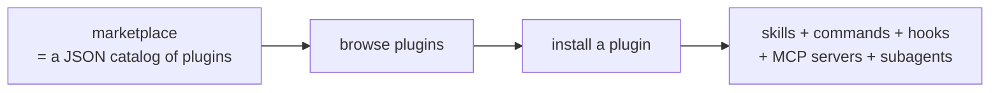
- **Two-step model: you add a marketplace first, then install plugins from it.** A marketplace is just a `marketplace.json` file cataloguing plugins someone has curated
- Anthropic's official marketplace ships with recent Claude Code — nothing to add
- Everything happens through `/plugin`:
  - run it bare for **interactive mode** (there's also a one-line `/plugin marketplace add <source>` form)
  - **Tab** cycles between the *discover*, *marketplaces*, and *installed* views; **Tab twice** gets you to marketplaces
  - On a marketplace: browse its plugins, update it (pulls newly listed plugins), disable it, remove it
  - Add a marketplace by source — a GitHub `owner/repo` is the simplest form. Claude clones it, finds `marketplace.json`, and lists what's inside
  - Adding a second marketplace makes the *discover* view show the combined catalogue from all of them
  - Installing: select the plugin → choose a **scope** → done. Verify under the *installed* tab, where you can also update or delete it
  - Also available: `/plugin install <plugin>@<marketplace>`, `/plugin uninstall <plugin>@<marketplace>`, and `/reload-plugins` when an install says the plugin needs activating
- ⚠️ **Installed plugins don't appear in your project.** No new files in `.claude/skills/` or `.claude/commands/` — plugins are managed in the `.claude` folder in your **home** directory. They work identically, they're just invisible from the repo
- Plugin skills are namespaced `/plugin-name:skill-name`, so they can't collide with your own

### Using a plugin's skill
- Nothing special — it behaves like any other skill. You can sanity-check it's live by asking "do you have access to a <name> skill?"
- Read the plugin's `SKILL.md` on its repo before using it. It tells you what it's for and, more usefully, what its *description* says — which is exactly what determines when Claude will reach for it
- It fires automatically on a matching request; the transcript shows Claude reporting which skill it used at the top of its response. Worth checking that line to confirm the skill actually engaged
- Skills compose with the rest of the workflow: you can just prompt against one, or route it through the full spec → plan → implement chain when the change is bigger
- Work on a branch when a skill is going to make sweeping changes, same as anything else

### ⚠️ Currency warning
Skills, commands, subagents, and plugins are the fastest-moving part of Claude Code — the commands/skills merge landed mid-recording, and skill frontmatter has changed since. **Check `code.claude.com/docs` before implementing anything from this chapter from memory.** In particular: the `title:` field shown in the course doesn't exist, and folder-name-vs-`name`-field behaviour is subtle.

---

## Chapter 6 — Subagents

### Agent vs subagent
- **AI agent** = a system that can make decisions and take actions on your behalf, using tools, context and instructions — not just answer with text. Claude Code itself fits this: it reads code, edits files, creates and deletes, runs commands, all autonomously from your initial prompt
- **Subagent** = a *separate Claude instance* the main agent spawns for a scoped, specialised task. Its own context window, its own system prompt, its own tool allowlist, optionally its own model. It works in isolation and **returns only a final summary to the parent**
- Mental model: the main agent is a **team leader** orchestrating specialists
- **You can build both — but at different levels.** Building a new top-level *agent* means building a tool like Claude Code itself (that's the Agent SDK's job). Building *subagents* is a normal part of using Claude Code: markdown files you write. That's the layer this chapter is about

### Built-in subagents
Claude Code already delegates to its own, which is why some of this is familiar:

| Subagent | Job |
|---|---|
| **Explore** | efficient codebase exploration — where does this feature fit, what already exists |
| **Plan** | the research/planning behind plan mode (Ch. 3) |
| **claude-code-guide** | answers questions about Claude Code itself |
| **Bash** | terminal/bash command handling |
| **general-purpose** | the default when none is specified |

So when plan mode "spun up a sub agent to research the codebase" back in Chapter 3 — that was this mechanism.

### Why bother — the five benefits
1. **Isolated context.** The subagent's window isn't polluted by unrelated history, and the main window isn't bloated by the subagent's file reads, test output and search results
2. **Specialisation.** Narrow instructions and a clear responsibility beat one general-purpose agent trying to do everything. A tuned accessibility auditor genuinely out-performs "also check accessibility"
3. **Tool restriction.** You declare exactly what it may touch. A read-only reviewer *cannot* modify what it's reviewing — that's enforced, not requested
4. **Parallelism.** Several can run at once while the main agent coordinates
5. **Model routing** (not covered in the course): a subagent can run on a cheaper/faster model than your main session, or a stronger one for the hard part

### ⭐ Skills vs subagents — your reasoning, checked
Your framing is **correct in its core**: a *skill* is expertise the model loads and then **executes itself**; a *subagent* is expertise the model **delegates to another executor**. In a skill, the knowledge is externalised but the actor is still the main model. With a subagent, both the knowledge and the acting move out.

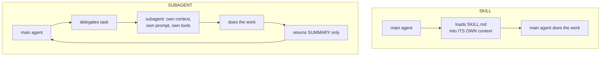

Your parallelism argument is right and is the strongest one. Three skills — review, test, deploy — run **sequentially in one context**, each adding bloat and each seeing the previous one's output. Three subagents run **at once, independently**. Two refinements worth adding:

- **Independence is a quality argument, not just a speed one.** Two reviewers in one context contaminate each other — the second sees the first's findings and anchors on them. Two subagents produce genuinely uncorrelated reviews. That's why the chapter's two reviewers are given deliberately non-overlapping remits (accessibility vs. readability/naming/performance/security) — "so they shouldn't step on each other's toes"
- **"The subagent is the final executor" is only true if you give it write tools.** In this chapter's reviewers it isn't: they get read + bash only, they return findings, and the **main agent implements the fixes**. Delegation of *analysis* is the common case; delegation of *action* is a choice you make in the tools list

Two corrections to the clean dividing line:
- **The boundary has blurred.** A skill with `context: fork` runs in a subagent. And a subagent can **preload skills** via a `skills:` frontmatter field. They're composable layers, not rivals
- **Isolation cuts both ways.** The subagent never sees your conversation history, so its instructions must stand alone; and the main agent only ever gets the summary, so the working detail is gone. When the task depends on what you've been discussing, keep it inline

**Choosing:**

| Reach for a **skill** when… | Reach for a **subagent** when… |
|---|---|
| it's a convention or style to apply *while* working | it's a self-contained job with a defined deliverable |
| the work needs your conversation history | the work would flood your context with reads/output |
| the main agent should keep reasoning about the result | you only need the conclusion, not the workings |
| it's cheap and inline (a commit message, a naming rule) | you need tool restriction, a different model, or parallelism |

### Creating a subagent
- Files live in **`.claude/agents/`** (project scope) or **`~/.claude/agents/`** (personal — available in every project). Markdown + YAML frontmatter; **the body becomes the subagent's system prompt**
- ⚠️ **Course is out of date here:** as of Claude Code v2.1.198 the `/agents` command **no longer opens the interactive creation wizard** — running it now just points you at asking Claude or editing `.claude/agents/` directly. The file format and locations are unchanged; only the wizard is gone. So the modern equivalent of the course's flow is simply: *"Create a project subagent that does X. Read-only. Use Sonnet."* and let Claude write the file
- **Frontmatter fields:** `name`, `description`, `tools` (comma-separated allowlist — inherits everything if omitted), `disallowedTools`, `model` (`sonnet` / `opus` / `haiku` / full model ID / `inherit`, the default), `permissionMode`, `skills` (preload skills into it), `mcpServers`, `hooks`, `maxTurns`, `effort`, `background`, `isolation`
- **The `description` is the trigger**, exactly as with skills — it's what Claude matches against to decide to delegate. Generated descriptions include *concrete examples* of when to invoke, and that's what makes autonomous invocation reliable. The word "PROACTIVELY" in a description nudges auto-invocation
- **Tools — grant the minimum.** Useful baselines:
  - read-only reviewer/auditor: `Read, Grep, Glob`
  - reviewer that needs to fetch its own diff: add `Bash`
  - researcher: `Read, Grep, Glob, WebFetch, WebSearch`
  - one that must write: `Read, Write, Edit, Bash, Glob, Grep`
  - needs an MCP server: include those tools. ⚠️ The tool-picker UI for MCP tools was buggy — the instructor's workaround was to select *all* MCP tools, then hand-edit the agent file afterwards to delete the ones it doesn't need. Worth doing regardless: every extra tool is context and risk
- `color` shows in the terminal whenever that subagent is working — genuinely useful when several run in parallel and you want to see who's who
- After creation: open the file and read it. Generated agents come out far more elaborate than your prompt, which is good, but they also bake in assumptions — the code-quality agent hard-coded "React, Next.js and TypeScript" into its identity line, which you'd strip out if you wanted the agent to be reusable across projects

### Writing a good reviewer subagent — the constraint that matters
The single most important instruction in both reviewer agents:

> Review only the code in the provided diff. **Treat the diff as the entire codebase.** Do not analyze or reference any code that is unchanged or not explicitly shown.

Without it, a reviewer wanders the whole repo and buries the feature you actually changed. Other patterns worth copying from the generated agents:
- A fixed **output format**: severity → category → file/line → the problem → current code → suggested fix → rationale
- Declared **severity levels** (critical / high / medium / low) so findings are triageable
- A **decision-making framework**: prioritise by impact, be pragmatic, only suggest refactors with clear value, acknowledge you're only seeing a diff
- **Positive observations** — call out what's done well, not just faults
- **When to escalate**: if the diff lacks context to judge, say what's missing instead of guessing
- **Self-check**: verify each finding's file path and line reference is correct before reporting

### Invoking subagents
- **Autonomously** — Claude decides, based on the description. Usually works, but it's probabilistic: "sometimes it invokes the agent, sometimes it doesn't"
- **Explicitly** — name the subagent in the prompt, or hard-wire it into a custom command. This is how you make it deterministic
- ⭐ **Wiring a subagent into a command** (the pattern that matters): in the `/spec` command's Figma section, one line was added at the top — *"use the Figma Design Extractor sub-agent to provide a design guide for the feature, citing the Figma hint, and tell it to do the following…"* — with the rest of the section left untouched. That single line hands the work off: main context stays clean, the subagent gets an isolated context plus specialised instructions, and it returns the design brief for the main agent to fold into the spec

### Running subagents in parallel — the `/code-review` command
A custom command whose only job is to **coordinate** two subagents.
- Front matter: description + `allowed-tools` limited to the two git diff commands it needs
- Stated goal, in order: gather the branch diff (staged **and** unstaged) → run both reviewers **in parallel on the same diff** → combine their feedback into one unified report → propose an action plan → **ask for approval before changing anything**
- Each subagent receives: the combined diff + brief repo context, plus instructions not to guess and not to review anything outside the diff
- The main agent then merges both reports into severity-grouped bullets, a **phased action plan**, and a list of open questions
- You reply with which phases to implement — e.g. "implement phases one and two" — and it executes only those
- Terminal shows both subagents running side by side, each in its own colour

The reusable shape: **a command as orchestrator, subagents as workers, a unified report as the deliverable, and a human approval gate before anything is written.**

### ⭐ The complete workflow, with subagents folded in
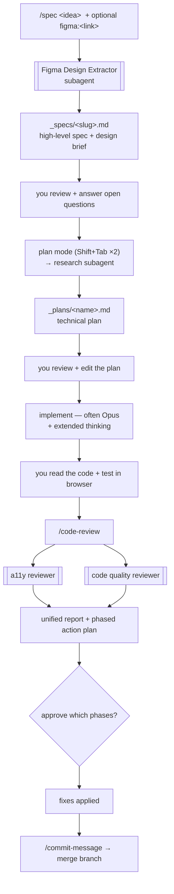
- Commit at the spec+plan stage, before implementation, so there's a clean rewind point
- **The human checkpoints are the point.** "We're not meant to be one-shotting features. There is going to be human input in this process" — you read the spec, edit the plan, review the code, and choose which findings to act on. The workflow is built to keep you in the loop, not to remove you from it
- Variations per project are expected; the sequence is the stable part

### Practical learning — rule drift
CLAUDE.md rules decay over a long session. Once a single violation slips through (the instructor's example: semicolons, banned in his CLAUDE.md), Claude treats the existing code as precedent and **the violation spreads across subsequent files**. Watch for the first leak rather than the tenth — or enforce the rule deterministically with a **hook** (formatter on write) instead of relying on instructions.

---

## Chapter 7 — Claude Code with GitHub

### ⭐ The CLI insight — is it correct?
> "If I can do a thing through the command line, then Claude Code can do it. So exposing things via CLI extends what Claude Code can do."

**Yes — and it's the most leverage-per-effort idea in this chapter.** The Bash tool is a universal adapter: installing `gh` gave Claude Code full GitHub capability with *zero* Claude-specific integration. The same trick works for `docker`, `aws`, `psql`, `terraform`, `kubectl`, or a shell script you write yourself. Five conditions to attach to it:

1. **Non-interactive.** The CLI must be scriptable. Full-screen TUIs and commands that block on interactive prompts don't work. Do the interactive part yourself once (`gh auth login`), then Claude uses the authenticated tool
2. **Permission-gated.** It can only run what your permission rules allow — `Bash(gh pr:*)` and so on. Capability still passes through your approval
3. **It has to know the CLI.** Well-known tools it knows from training. For an obscure or internal CLI, point it at `--help`, or document the commands in CLAUDE.md or a skill
4. **Output costs context.** Command output lands in the window. Prefer flags that return narrow, structured output (`gh pr list --json ...`) over commands that dump pages
5. **It inherits your credentials.** Anything Claude runs can use the auth on your machine. Deny rules matter for destructive or credential-adjacent commands

**CLI vs MCP** — the two ways to extend reach:

| | CLI + Bash | MCP server |
|---|---|---|
| Setup | install + auth once | add server, manage scope/keys |
| Permissions | coarse (bash patterns) | per-tool, granular |
| Returns | text you pay context for | structured, purpose-built |
| Best when | a good CLI already exists | no CLI, OAuth/remote auth, or you want tool-level control |

Generalisation worth keeping: **the cheapest way to give Claude a new capability is usually to give it a command, not an integration.** A five-line wrapper script in your repo is a legitimate tool.

### Three distinct ways Claude touches GitHub
Easy to blur — they're separate mechanisms with different homes:

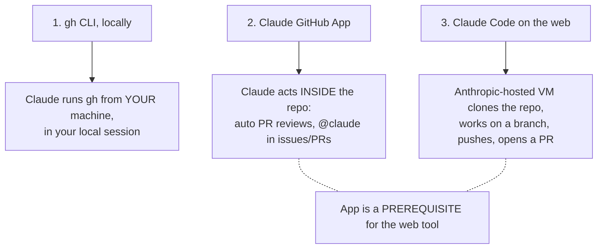

### 1 — GitHub CLI (local)
- Install: `brew install gh` (Mac) / `winget` (Windows). Prereqs: a GitHub account and git itself (git-scm.com)
- Authenticate once: `gh auth login` → a series of questions (defaults are fine) → browser login gives a one-time code to paste, or use a token
- `gh` prefixes every GitHub CLI command
- Then just ask in plain language; Claude picks the commands:
  - *"Can you make a new private GitHub repo for this project called X and push up the main branch?"* → `gh repo create …`, returns the repo link
  - *"Can you push up this branch and open a PR for it?"* → `git push`, then `gh pr create` with a title and a body it writes as a summary of the changes
- 🗒️ Practical heuristic from the instructor: for trivial git (`git switch main`, `git pull`) **don't prompt** — it takes longer to write the prompt than to run it. Use bash mode (`!`). Reserve prompting for things where Claude adds judgement, like composing a PR body

### 2 — The Claude GitHub App
Installed from a local session with **`/install-github-app`**:
1. It offers the repo your local project is connected to (or type another)
2. Browser opens → install to all repos or selected ones → confirm with passkey/password
3. Back in the terminal, press enter, then choose **which workflows** to enable (spacebar toggles):
   - **@claude mentions** in issues and PRs
   - **automatic PR reviews** on creation
4. Choose billing: a long-lived token tied to your **Claude subscription**, or an API key for API billing. ⚠️ Either way, **usage counts against your limits**
5. Authorize in the browser → it creates a **GitHub Actions workflow** file → opens a prefilled PR → create and merge it
6. Verify at repo → Settings → Apps

**Automatic PR reviews:** fire when a PR is opened, take a few minutes. Expect no feedback on trivial diffs — that's normal, not a failure.

**Tagging `@claude`:** comment `@claude can you review this PR and offer feedback`.
- 👀 reaction = it has seen the comment; it then posts its own comment and **edits that comment live** as it works
- Output is a real review: critical issues (leftover `console.log`, a missing file, a log file that shouldn't be committed), style-guide compliance, minor issues — with links to jump into Claude Code on the web to fix them
- **Also works on issues.** Tag `@claude can you fix this` in an issue and it works remotely, **always on a new branch, never main**, then posts a summary with a link to open a PR
- When it's worth it: team projects, or solo projects where you want an independent second review and somewhere to park issues for Claude to pick up

### 3 — Claude Code on the web
At **claude.ai/code**. A cloud version: connects to your GitHub repo, **clones it onto an Anthropic-hosted VM**, analyses, changes code on a new branch, pushes it back, and offers to open a PR.

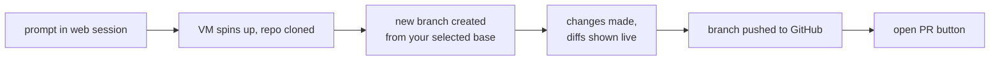
**Requirements:** the project must already be on GitHub, **and the Claude app must be installed on that repo** — otherwise the session errors out.

Setup and options:
- Connect your GitHub account (visible under connectors)
- Pick **repo** + **base branch**. The branch is only a jumping-off point — **it never edits your selected branch directly**; it always cuts a new one
- **Sessions** are listed in the sidebar; the file-drawer icon **archives** (not deletes — the funnel icon filters to archived)
- **Model** switch via the three dots: Sonnet default, or Opus / Haiku
- **Environments** — configurable per session. Name, **network access** (trusted sources only / no network / full internet / custom allowed domains), and **environment variables** (API keys, DB connection strings) entered like a `.env`
- Still a research preview at time of recording, so the UI and behaviour shift

Working in it:
- Diffs stream inline as it works (green added, red removed), with a summary at the end, same as a local session
- ⚠️ **It can be wrong about project state.** In the transcript it reported features as unimplemented that were fully built. Mitigation: keep CLAUDE.md current — that's what it reads to understand the project
- ⚠️ At the time of recording, the automatic review sometimes appeared **buried at the bottom of the session summary** instead of as a PR comment. Workaround: tag `@claude` in the PR and ask for the review directly

### Teleporting a web session to local
- In the web session, click **Open in CLI** — it copies a command to your clipboard
- Paste it in a terminal **inside your local project**: `claude --teleport <session-id>`
- It brings down **the chat history *and* the branch** — checked out locally with the code changes already applied
- So you continue the same session locally, preview on your dev server, then push and PR as normal
- The point: start something from your phone, finish it properly at your desk

### 🗒️ When to use web vs local (the instructor's actual practice)
- **Build the core locally first.** Get real structure in place before involving the web tool, and **keep CLAUDE.md up to date** so the web tool has accurate context
- **Web is mostly for when you're away from your machine** — it's in the Claude mobile app too. A thought hits you on the sofa, you fire off a session
- **Good for:** bug fixes, small features, design tweaks. Open a PR and preview before merging
- **Not for:** fleshing out entire features. Complex work goes back to the desk and through the spec → plan → implement workflow

---

## Platforms & services (free tiers, useful for personal projects)

### Vercel — deployment + preview environments
Cloud platform for deploying web apps; pairs naturally with Claude Code because it turns every PR into something you can *look at*.

**Setup:**
1. Sign up → **Hobby plan** (free) → create the account **with GitHub as the provider**
2. Dashboard → **Import** a project from GitHub → first install the **Vercel GitHub app** (all repos or selected)
3. Import screen: repo + **branch to deploy** (main = production), project name, **framework preset** (auto-detected), build settings, and **environment variables** — set these here if your app needs them
4. Deploy

**How it behaves afterwards:**
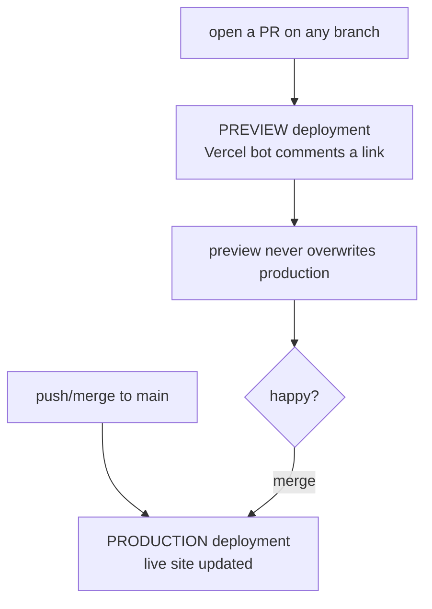
- Merging into main automatically triggers a redeploy, keeping the live site in sync with the repo
- Opening a PR gets a **Vercel bot comment with a preview link** — a real deployed URL for that branch alone
- Project dashboard: visit the site, jump to the repo, see the deployment list, **roll back to a previous deployment**

**Why it matters for this workflow:** it closes the loop when you don't have the local repo. Fire a task from the phone → Claude opens a PR → Vercel deploys a preview → you check it in the browser → merge. No laptop involved.

### Firebase
*(to fill in — MCP server and plugin covered earlier in the course; auth + Firestore used for the demo app's backend)*

---

## Reusable assets

````markdown
---
description: Create a commit message by analyzing git diffs
allowed-tools: Bash(git status:*), Bash(git diff --staged), Bash(git commit:*)
---

Analyze the staged changes in the repo and create a commit message based on
those changes. Use present tense and explain *why* something changed where
possible.

## Context

Current git status: !`git status`
Current git diff: !`git diff --staged`

## Emojis

Use only these:
✨ new features · 🐛 bug fixes · 🔨 refactors · 📄 docs ·
🎨 styles · ✅ tests · ⚡ performance

## Format

```
<emoji> <type>: <concise description>

<optional body explaining why>
```

## Output

1. A summary of the currently staged changes
2. The proposed commit message with emoji
3. A confirmation request before committing

Do not auto-commit. Wait for user confirmation.
````

### `.claude/commands/component.md` — argument pattern skeleton
```markdown
---
description: Creates a UI component using test-driven development
argument-hint: [brief component description]
allowed-tools: Read, Write, Edit, Glob, Bash
---

## User input

The user has provided information about the component to make: $ARGUMENTS

1. Derive a PascalCase component name from the user input
2. Write tests FIRST — place them in <test dir>, a few simple, meaningful tests
3. Run the tests; expect them to fail (component doesn't exist yet)
4. Create the component following the project's existing structure/conventions
5. Re-run the tests; iterate until they pass
6. Add the component to the preview page
```
The shape is the reusable part: arguments → naming rule → tests-first → build → verify → preview.

### Prettier-on-edit hook
Event `PostToolUse`, matcher `Write|Edit`:
```bash
jq -r '.tool_input.file_path' | { read fp; [[ "$fp" =~ \.tsx?$ ]] && npx prettier --write "$fp"; }
```
- `jq -r` pulls the edited file's path raw
- `read fp` captures it into a variable
- `[[ ... =~ \.tsx?$ ]]` guards on extension — swap the regex for whatever the formatter should touch
- `&&` only runs Prettier if the guard passes

### `.claude/commands/spec.md`
*(awaiting full content — structure in Ch. 3; Figma argument + step 2.5 in Ch. 4; subagent hand-off line in Ch. 6)*

### `.claude/commands/code-review.md`
*(awaiting full content — orchestrator pattern summarised in Ch. 6)*

### `.claude/agents/figma-design-extractor.md`
*(awaiting full content — purpose and tool setup in Ch. 6)*

### `.claude/agents/a11y-reviewer.md`
*(awaiting full content — diff-only constraint and output format in Ch. 6)*

### `.claude/agents/code-quality-reviewer.md`
*(awaiting full content — remit deliberately disjoint from the a11y reviewer)*

### `_specs/template.md`
*(awaiting full content — sections listed in Chapter 3)*

---

## 📚 Anthropic docs map — *to build*
A section mapping the official docs: which page covers what, so a lookup goes straight to the right place.
Starting points noted so far:
- `code.claude.com/docs` — Claude Code docs (skills, plugins, hooks, permissions, settings, sub-agents, commands reference)
- `code.claude.com/docs/llms.txt` — the full documentation index, listing every available page
- `platform.claude.com/docs` — API / Agent SDK / Agent Skills overview + best practices
- `agentskills.io` — the Agent Skills open standard (portable across tools)
- `github.com/anthropics/skills` — Anthropic's public skills repo, useful as reference implementations

---

## 🔖 To add later
- **Firebase** — fill in the stub under *Platforms & services* (MCP server, plugin, auth + Firestore)
